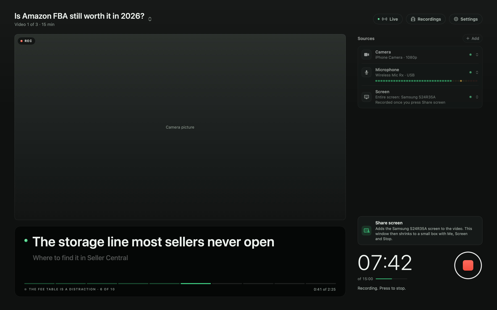

# AVA Recorder

A free, private Loom replacement for filming YouTube videos on a Mac. One button records the camera, the mic and the screen as separate files that stay in sync. When you stop, it writes a transcript, YouTube chapters and a list of retakes, ready for editing.

Built by AVA INC for our own channel. You are welcome to build your own copy and change it.



## What it does

- **One Start button.** Camera and mic start together, and the screen joins when you share it; everything stops together. Files are written in 2-second pieces, so a crash keeps the take.
- **Clean screen recording.** The app's own windows, pop-up banners and Notification Center are kept out of the video.
- **Face box.** While recording, a small box in the corner has Me | Screen, the time, the mic level and a stop button. While the screen shows, it also shows your face, framed automatically like a camera operator would: still while you talk, a smooth glide when you move. It is only on your screen, never in the video.
- **Face in the video, if you want it.** A face bubble can go into the screen recording, in a circle, square, oval or wide shape. The camera is also saved as its own file, so the shape can still change in editing.
- **More than one camera.** Any extra camera records its own file next to the main one.
- **Live view.** Watch the shoot from another laptop or phone in a browser, with no login: every camera, the screen, the mic level and the checks. Listen to the mic on headphones, pin any picture big or go full screen, see which one is in the video and the line being read.
- **Recordings page.** Every take with a picture, search, filters, rename, save a copy and delete. Click a take to watch it in the app, camera or screen.
- **Me | Screen, one click.** Click Me and your camera grows out of the face circle to fill the screen; click Screen and it shrinks back. The screen recording captures that, so the finished `video.mp4` needs no cutting.
- **Your iPhone over Wi-Fi, with any Apple Account.** Pick "iPhone over Wi-Fi" in the Camera row, scan the code with the iPhone and tap Start camera in Safari. No app and no cable; up to 1080p at 30 frames a second.
- **Starts on your face, shares when you are ready.** Every take starts on the camera, after a 3, 2, 1 that is not recorded, and the recorder window stays put. Press Share screen to add the entire screen or one window (only then does the window shrink to a small box), picked from pictures like Google Meet, even an app in full screen on another desktop. The last pick comes up already picked.
- **Mac sound, any moment.** Switch what the Mac plays into the video or out of it during the take, from every app or only one (a video in Chrome).
- **A prompter that scrolls by itself** at a chosen speed, or follows your voice or a key, with adjustable text size.
- **A transcript tick box,** for quick videos that do not need a transcript.
- **A guide to connecting cameras,** in Settings: iPhone, USB webcam or a real camera, with the cameras the Mac sees right now.
- **Checks before you start.** Camera, mic, screen, disk space, battery and macOS camera effects, each with a plain fix when something is wrong.
- **Camera watchdog.** If the camera file stops growing during a take, the take stops at once and says so, instead of filming on without a camera.
- **Finishing.** After every take, `ava-finish` takes the empty padding out of the camera file (about a third of it, with no change to the picture or sound), lines up the files by their sound, makes `video.mp4` and writes `words.json`, `chapters.txt`, `retakes.json` and `report.md`, all on the Mac.

## What you need

- A Mac with Apple silicon on macOS 15 or later.
- Xcode or the Xcode command line tools (`xcode-select --install`).
- [Homebrew](https://brew.sh), then `brew install ffmpeg whisper-cpp` for finishing.
- A speech model for the transcript, saved as `~/.cache/whisper/ggml-large-v3-turbo-q5_0.bin` (about 550 MB, from the whisper.cpp models on Hugging Face). Without it, recording still works and only the transcript is skipped.
- A free Apple Development certificate. macOS refuses screen recording to apps without one. In Xcode: Settings > Accounts, add your Apple ID, then Manage Certificates > + > Apple Development.
- Optional, for the live view outside your home Wi-Fi: `brew install cloudflared`.

## Build and run

```bash
bash Tools/build.sh
```

```bash
open "dist/AVA Recorder.app"
```

The first time, allow the camera and the microphone, then click the red **Record** row and allow screen recording in System Settings. Quit and open the app again. [HOW-TO-FILM.md](HOW-TO-FILM.md) walks through a filming day.

## Using an iPhone as the camera

Plug the iPhone into the Mac with a cable, lock it, and stand it on a tripod in landscape with the rear camera facing you. It appears as a camera on its own through Continuity Camera. This only works when the Mac user and the iPhone are signed in to the same Apple ID.

## Where recordings go

`/Users/Shared/AVA Recordings/<date> <title>/recording-N/`. The folder is shared, so a second Mac user can record into it too. [PLAN.md](PLAN.md) lists every file and what is in it.

## Make it yours

- **Name and bundle id:** `Tools/Info.plist`.
- **Recording folder:** `Library.root` in `Sources/AVARecorder/Library.swift`.
- **Colours and type:** `Sources/AVARecorder/Theme.swift`. [DESIGN.md](DESIGN.md) explains the look.
- **Finishing steps:** `Sources/ava-finish/`.

Check your changes with:

```bash
SKIP_FIXTURE=1 bash Tests/run_tests.sh
```

Leave out `SKIP_FIXTURE=1` the first time, so the test videos get built. To see the screens without recording anything, run the app with `--snapshot <folder>` and it saves pictures of them.

## Privacy

Everything stays on your Mac: video, sound, transcript and the live view. The only exception is the live view's **Anywhere** mode, which sends the page through a Cloudflare tunnel to whoever has the secret link.
