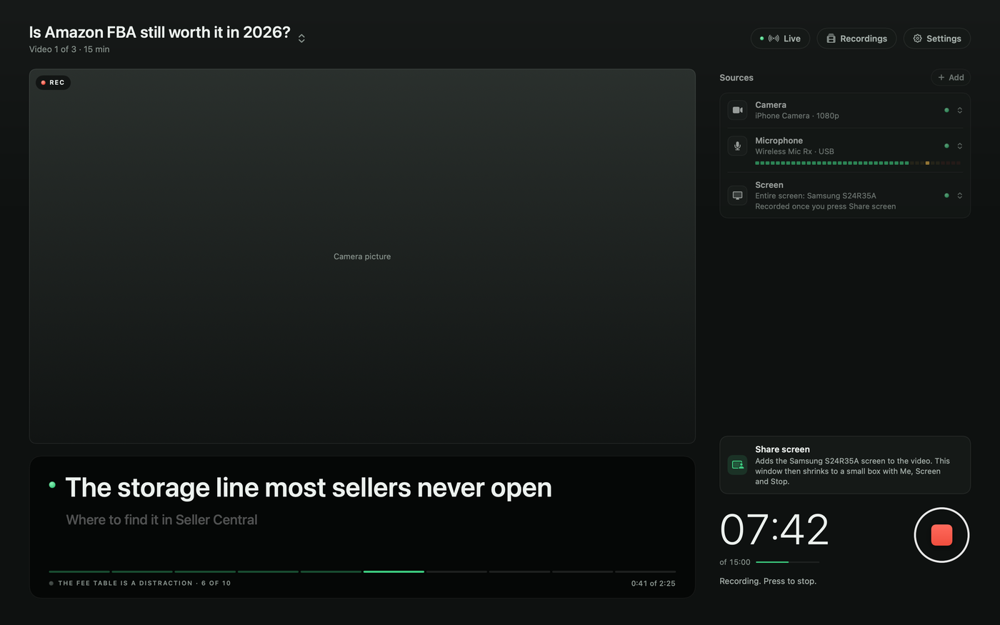
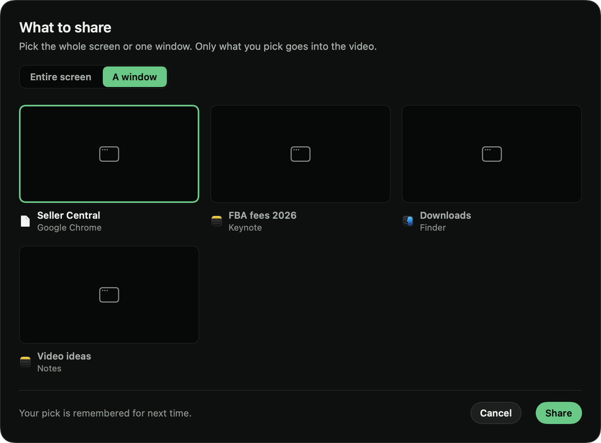
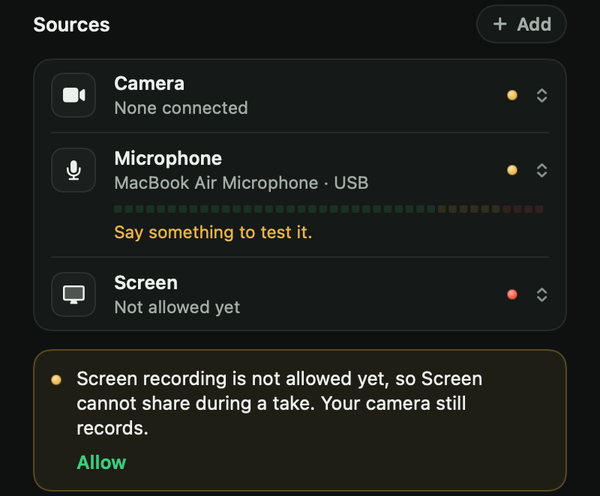
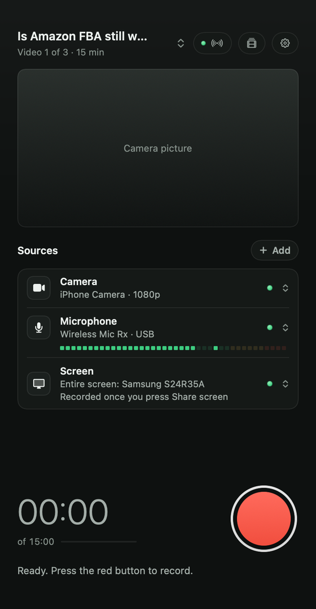
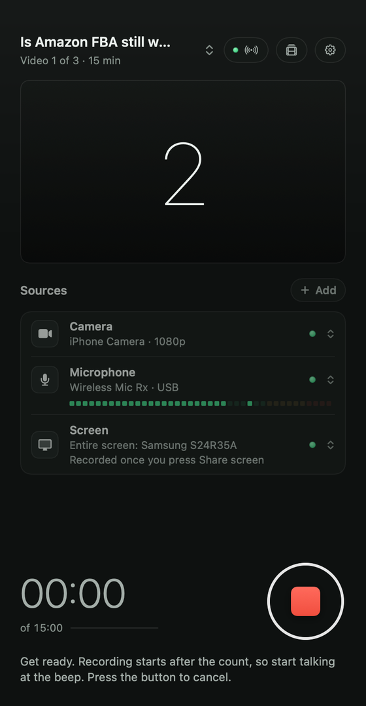
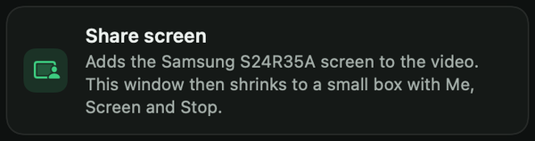

# Vidlark

**A free recorder for videos. One red button records your camera, your mic and your screen, and hands you a finished video, ready to upload.**

[](LICENSE) [](#install-on-a-mac) [](https://github.com/neel542/vidlark/releases)

**[Website](https://vidlark.vercel.app)** · **[Download for Windows (beta)](https://github.com/neel542/vidlark/releases)** · **[How to use](docs/guide.md)** · **[Feedback](https://vidlark.vercel.app/feedback)**

<p align="center">
  
</p>

Vidlark is a free, open source replacement for Loom, made for filming YouTube videos. Press the red button and your camera and mic start. Share your screen whenever you are ready. When you stop, Vidlark lines everything up and makes `video.mp4`, plus a transcript, YouTube chapters and a list of the places you said "retake".

No account, no subscription, no watermark and no time limit. Everything stays on your computer.

**Jump to:** [Install on a Mac](#install-on-a-mac) · [Install on Windows](#install-on-windows-beta) · [Make your first video](#make-your-first-video) · [Change it with Claude](#change-it-with-claude) · [If something goes wrong](#if-something-goes-wrong)

## What it does

- **One button.** Your camera and mic start together after a 3, 2, 1. Add your screen when you are ready. Everything stops together.
- **A finished video.** `video.mp4` follows your **Me** and **Screen** clicks, so there is nothing to cut by hand. When it shows your camera full screen, the picture follows your face like a camera operator.
- **Separate files that stay in sync.** The camera, the screen and every extra camera or mic are saved as their own files and lined up by sound, ready for editing.
- **Transcript, chapters and retakes.** Every word with its time, YouTube chapters, and every "retake" you said out loud. All made on your Mac.
- **Phones as cameras and mics.** Any iPhone or Android phone, over Wi-Fi, with no app and no cable. Up to four at once.
- **Never loses a take.** Files are written in 2-second pieces, so a crash keeps everything up to the last 2 seconds.
- **Clean recordings.** Vidlark's own windows and Notification Center's pop-ups are kept out of the video.

| The recording box | Pick what to share | Every take in one place |
|:---:|:---:|:---:|
|  |  |  |

<details>
<summary><b>More features</b></summary>

- **Your face in the video, if you want it.** While the video shows the screen, your face can sit in a corner as a circle, square, oval or wide shape. Drag it anywhere. The camera file is always saved too, so you can change your mind in editing.
- **One window or the whole screen.** Share one window and only that window goes into the video, even if something covers it.
- **The Mac's sound.** Put what the Mac plays into the video, from every app or only one (a video in Chrome), and switch it at any moment.
- **A prompter.** Your script one line at a time, on a screen that is not recorded. It follows your voice, a key, a Bluetooth remote, or scrolls by itself.
- **Live view.** Watch the shoot from another laptop or phone in a browser, with no login: every camera, the screen, the mic level, and the mic itself on headphones.
- **Recordings page.** Every take with a picture. Search, filter, rename, save a copy, or delete to the Trash. Watch a take in the app and switch between the finished video, the camera and the screen at the same moment.
- **Checks before you start.** Camera, mic, screen, disk space, battery and Low Power Mode, each with a plain fix when something is wrong.
- **Camera watchdog.** If the camera stops sending pictures during a take, the take stops and says so, instead of filming on without a camera.
- **Light on your Mac.** Between takes the camera runs slower and rests when Vidlark is in the background. Phones filming other angles wait until a take starts.

[The full guide](docs/guide.md) explains every one of these.
</details>

### Mac or Windows?

| | Mac | Windows |
|---|---|---|
| Ready? | Yes | Beta 0.2, still being tested |
| How you get it | Built on your Mac from this code, once (free) | A zip file to download |
| Needs | Apple silicon (M1 or newer), macOS 15 or later | Windows 11, 64-bit |
| Camera, mics, screen and the finished video | Yes | Yes |
| Transcript, phones, live view, prompter, Recordings page | Yes | Not yet |

## Install on a Mac

There is no Mac download yet. You build Vidlark on your own Mac from this code, once. Everything it needs is free. Claude Code can do the whole thing for you, or you can follow the steps by hand.

**What you need**

- A Mac with Apple silicon (M1 or newer) on macOS 15 or later.
- The **Xcode** app from the App Store. It is free, and it is the biggest download, so start it first.
- An Apple ID. The free one you already use for the App Store is fine.

### With Claude Code

[Claude Code](https://claude.com/claude-code) is Anthropic's coding assistant, in the Claude desktop app or in Terminal. It needs a paid Claude plan; the steps by hand cost nothing. Paste this into Claude Code and answer its questions:

```text
Set up Vidlark on my Mac for me. Vidlark is a free camera and screen recorder.
Its code is at https://github.com/neel542/vidlark and its README explains the install.

1. Check that this Mac has Apple silicon and macOS 15 or later. If it does not, stop and tell me.
2. Install what it needs, skipping anything already installed: Xcode's command line tools,
   Homebrew, then ffmpeg and whisper-cpp with Homebrew.
3. Clone the repo into my home folder and build it with: bash Tools/build.sh
4. Screen recording needs a free Apple Development certificate. If the build says it signed
   ad hoc, walk me through adding one in Xcode one click at a time, wait for me, check it with
   security find-identity -v -p codesigning, then build again.
5. Download the speech model for transcripts into ~/.cache/whisper, as the README says.
6. Open dist/Vidlark.app

Before you install anything, tell me what it is and wait for my yes. If a step needs my
password, give me the exact command to run in Terminal myself. When it is done, tell me
what is left for me to do.
```

One step stays yours: signing in to Xcode for the certificate. Claude tells you where to click, waits, then builds again.

### By hand

Open the **Terminal** app (it is in Applications, Utilities) and do these in order. Paste each command, press Return, and wait for it to finish.

1. **Install Xcode** from the App Store, if you have not already. Open it once and let it finish setting up.

2. **Install Xcode's command line tools.** If they are already there, Terminal says so.

   ```bash
   xcode-select --install
   ```

3. **Install Homebrew, then the two tools that finish each take.** ffmpeg makes the finished video and whisper-cpp writes the transcript. Homebrew may ask for your Mac's password; the letters do not show as you type.

   ```bash
   /bin/bash -c "$(curl -fsSL https://raw.githubusercontent.com/Homebrew/install/HEAD/install.sh)"
   brew install ffmpeg whisper-cpp
   ```

   When Homebrew finishes, it may print a "Next steps" command or two. Run them, so the `brew` command works.

4. **Get the free certificate.** Follow [the certificate steps](#the-free-certificate-step-by-step) below. This is the step most people miss.

5. **Download the code.**

   ```bash
   cd ~
   git clone https://github.com/neel542/vidlark.git
   cd vidlark
   ```

6. **Build Vidlark and open it.** The build finds your certificate by itself. It should end with `Signed with: Apple Development: ...` and `Built dist/Vidlark.app`.

   ```bash
   bash Tools/build.sh
   open dist/Vidlark.app
   ```

7. **For transcripts, download the speech model** (about 550 MB). Without it, everything still records, and only the transcript and the retakes list are skipped.

   ```bash
   mkdir -p ~/.cache/whisper
   curl -L -o ~/.cache/whisper/ggml-large-v3-turbo-q5_0.bin https://huggingface.co/ggerganov/whisper.cpp/resolve/main/ggml-large-v3-turbo-q5_0.bin
   ```

To open Vidlark again later, double-click **Vidlark** in the `vidlark/dist` folder in your home folder, or run `open ~/vidlark/dist/Vidlark.app`.

### The free certificate, step by step

macOS 15 and later only let an app record the screen when it is signed with a real certificate. Without one, the camera and mic still record, but sharing the screen is refused, even after you switch Vidlark on in System Settings. The certificate is free, needs no paid Apple Developer account, and stays on your Mac.

1. Open **Xcode**. If it offers to download extra platforms such as iOS, you do not need them for Vidlark.
2. In the menu bar, click **Xcode**, then **Settings** (or press Command-Comma). Click **Accounts**.
3. Click **+** at the bottom left, pick **Apple ID**, click **Continue**, and sign in.
4. Click your account in the list, then click **Manage Certificates**.
5. Click **+** at the bottom left of that window and pick **Apple Development**. A line called Apple Development appears. Click **Done**. You can quit Xcode now.
6. Check that it worked. In Terminal, run:

   ```bash
   security find-identity -v -p codesigning
   ```

   One of the lines should say `Apple Development`. If it says `0 valid identities found`, go back to step 4.
7. Build again with `bash Tools/build.sh` (from the `vidlark` folder). It should say `Signed with: Apple Development: ...`. If macOS asks whether `codesign` may use a key in your keychain, type your Mac's login password and click **Always Allow**.

<details>
<summary><b>Updating to a newer version</b></summary>

Check Vidlark is not recording, because the build replaces the app. Then:

```bash
cd ~/vidlark
git pull
bash Tools/build.sh
```

Your recordings and settings are kept.
</details>

## Install on Windows (beta)

Vidlark for Windows is new. It records your camera, your mics and your screen and makes the finished video, but it has only been tried on a few PCs so far. Keep a copy of any take that matters, and [tell us what goes wrong](https://vidlark.vercel.app/feedback).

It needs Windows 11, 64-bit, and a webcam and a mic. There is nothing else to install: ffmpeg comes inside the download.

1. Download **[Vidlark-Windows.zip](https://github.com/neel542/vidlark/releases/download/windows-v0.2/Vidlark-Windows.zip)** (about 70 MB) from the [0.2 beta](https://github.com/neel542/vidlark/releases/tag/windows-v0.2). Newer betas appear at the top of the [Releases page](https://github.com/neel542/vidlark/releases).
2. Right-click the zip, choose **Extract All**, then **Extract**. Keep the folder together: the app and its tools sit side by side in it.
3. Open the **Vidlark** folder and double-click **Vidlark.exe**.
4. The first time, Windows says "Windows protected your PC", because Vidlark is new and not signed yet. Click **More info**, then **Run anyway**.

**Your first video on Windows:** type a title where it says "What is this video called?", check the camera and mic, and press the red button. After the 3, 2, 1, press **Share screen**, pick **Entire screen** or **A window**, and tick **Include the computer's sound** if you want it. Vidlark shrinks to a small box with **Me**, **Screen**, **Face** (your face in the corner or not), **Sound**, **Vidlark** (the window back) and Stop. After Stop, **Show the take** opens the folder. Takes are saved in `C:\Users\Public\Videos\Vidlark Recordings`.

Not in this beta yet: the transcript, phones, live view, the prompter, face framing, the Recordings and Settings pages, and sound from one app only. The [release notes](windows/release-notes.md) list what changed.

## Make your first video

These steps are for the Mac. Windows works the same way, with fewer buttons (see above).

**1. Allow the camera, the mic and the screen.** The first time you open Vidlark, macOS asks for the camera and the microphone: click **Allow**. A note under the Sources list asks for screen recording: click **Allow**, switch on **Vidlark** in System Settings, under Privacy & Security, Screen & System Audio Recording, then quit Vidlark and open it again.



**2. Give the video a name (optional).** Each take's folder is named after the script's title. Drag a script (a `.md` or `.txt` file) onto the window, or click the title at the top left and pick **Add script file** or **Paste script**. A line at the top like `# Your title` becomes the name (otherwise the file's name), and the script goes on the prompter. No script? The take is called "Quick recording" with the time, and you can rename it later in Recordings. [Script format](docs/guide.md#scripts-and-the-prompter).

**3. Check the Sources list.** It shows your camera, mic and screen, each with a lamp. Green means ready. Say a few words and the mic's meter moves. Click a row to change it.

**4. Press the red button.** It counts down 3, 2, 1 with beeps. Start talking at the higher beep: that is when recording starts. The count is not recorded, and pressing the button again during it cancels the take.

| Ready to record | The countdown |
|:---:|:---:|
|  |  |

**5. Share your screen when you want it in the video.** Every take starts on your camera. When you are ready, press **Share screen** in the Vidlark window. Pick **Entire screen** or **A window**, then **Share**. Your pick is remembered for next time.




**6. Use the recording box.** The Vidlark window steps aside and a small box sits in the top corner. Your camera fills the screen for a moment, then the video changes to your screen. The box is only on your screen, never in the video.

- **Me** grows your camera to fill the screen. **Screen** shrinks it away and shows the screen again. The finished video follows these clicks.
- **Mac sound** puts what the Mac plays into the video: **Off**, **Every app**, or **Only** one app.
- The face button puts your face in a corner of the video, in the shape set in Settings, In the video.
- **Back to the recorder** brings the Vidlark window up over everything. It is never in the video either.

| Showing the screen | Showing you (Me) |
|:---:|:---:|
|  |  |

**7. Press stop.** Click the red square in the box (or the big button in the Vidlark window). Vidlark comes back, lines up the files, makes `video.mp4` and writes the transcript. A long take takes a minute or two. Then it says "Saved and finished".


**8. Open your video.** Click **Open folder**, or open **Recordings** (the button at the top right, or Command-Shift-R) to watch it in the app. `video.mp4` is the one to upload.

Made a mistake? Say **"retake"** and say the line again. The take keeps going, and `retakes.json` lists the time of every retake, so you can find them in editing.

[The full guide](docs/guide.md) covers the prompter, the Recordings page, live view and every setting.

## Phones as cameras

Any iPhone or Android phone can film, over your Wi-Fi, with any account. There is no app to install and no cable.

1. Press **+ Add** and pick **Add a phone with a QR code** to film another angle. To film with the phone as your main camera, click the **Camera** row and pick **Phone over Wi-Fi** instead.
2. Point the phone's camera at the code and tap the link that appears.
3. The first time, the phone warns that the connection is not private. That is expected: the link is Vidlark's own, only on your Wi-Fi. On an iPhone, tap **Show Details**, then **visit this website**, then **Visit Website**. On Android, tap **Advanced**, then **Proceed**.
4. Pick **Wide 16:9** or **Tall 9:16**, tap **Start camera**, then **Allow**. The window on the Mac says **Connected**.


Each phone records its own file (`camera-2.mov` and on), up to 1080p at 30 frames a second, lined up with the main camera by sound. Up to four phones can film at once. Keep the phone plugged in for a long take.

An iPhone can also join through Apple's Continuity Camera, with the sharpest picture, when the iPhone and the Mac use the same Apple Account. Settings, **Connect a camera** walks through that, a USB webcam and a real camera.

## More microphones

Press **+ Add** and pick a mic under **Another microphone**: a USB mic, a wireless kit's receiver, AirPods, or a phone. To use a spare phone as a wireless mic, pick **A phone as a microphone, with a QR code**, scan it, tap **Start microphone**, then **Allow**, and keep the phone about a hand's width from the mouth of the person talking.


Every mic records its own file (`mic-2.m4a` and on). To use one for the finished video's sound, open its row's menu and pick **Use for the video's sound**. While watching a take, you can play any mic under any picture to hear which is best.

## Where your recordings go

Every take gets its own folder:

- **Mac:** `/Users/Shared/Vidlark Recordings/<date> <title>/recording-1/` (shared, so every account on the Mac can use it)
- **Windows:** `C:\Users\Public\Videos\Vidlark Recordings\<date> <title>\recording-1\`

| File | What it is |
|---|---|
| `video.mp4` | **The finished video, to upload.** It follows your Me and Screen clicks. Made when you shared your screen, or picked another mic for the video's sound. |
| `camera.mov` | Your camera, with your voice. In a take where you never shared the screen, this is your video. |
| `screen.mov` | Your screen from the moment you shared it, with your voice, and the Mac's sound if it was on. |
| `camera-2.mov` and on | Each extra camera or phone. |
| `mic-2.m4a` and on | Each extra microphone. |
| `words.json` | The transcript, with the time of every word. |
| `chapters.txt` | YouTube chapters to paste into the description. |
| `retakes.json` | Every place you said "retake", with its time. |
| `report.md` | A plain summary of the take, including anything that went wrong. |

The other files (`events.jsonl`, `sync.json`, `mic.wav`, `faces.json`, `script.md`) help with editing. [PLAN.md](PLAN.md) explains every file.

## Change it with Claude

Don't like a feature, or want one Vidlark does not have? Vidlark is open source, and [Claude Code](https://claude.com/claude-code) can change it for you in plain words. You do not need to know how to code. Claude Code needs a paid Claude plan.

1. **Get the code**, if you have not already: `git clone https://github.com/neel542/vidlark.git`
2. **Open the `vidlark` folder in Claude Code** (in the desktop app, or run `claude` in that folder in Terminal).
3. **Say what you want**, for example:
   - "Make the countdown 5 seconds instead of 3."
   - "Save my takes in my Movies folder."
   - "Add a button that pauses the take."
   - "Make the app purple instead of green."
4. **Claude makes the change, builds Vidlark and runs the tests.** [CLAUDE.md](CLAUDE.md) tells it how the project fits together, and asks it to check before installing anything and to say plainly what it checked.
5. **Try your version.** Keep it, change it again, or share it. The MIT licence allows all three, as long as the licence notice stays with the code.

Think everyone would want your change? [CONTRIBUTING.md](CONTRIBUTING.md) explains how to send it back as a pull request. Claude Code can help with that too.

## If something goes wrong

<details>
<summary><b>Sharing the screen is refused, even though Vidlark is switched on in System Settings</b></summary>

Vidlark was built without the free certificate. Run `security find-identity -v -p codesigning` in Terminal. If no line says `Apple Development`, follow [the certificate steps](#the-free-certificate-step-by-step), then build again. If the certificate is there and it is still refused, open System Settings, Privacy & Security, Screen & System Audio Recording, select Vidlark, remove it with the **minus** button, then open Vidlark and allow it again.
</details>

<details>
<summary><b>The build says "no Apple Development certificate found"</b></summary>

The app was signed without a certificate, so screen recording will be refused. Do [the certificate steps](#the-free-certificate-step-by-step), then run `bash Tools/build.sh` again.
</details>

<details>
<summary><b>There is no transcript, or chapters.txt is empty</b></summary>

Open `report.md` in the take's folder: it says why. Usually the speech model is missing (do step 7 of the install), or whisper-cpp is not installed (`brew install whisper-cpp`). Also check Settings, After each take: **Transcript and chapters** must be on. On Windows, the beta does not make a transcript yet.

Chapters come from the script's sections and the apps you switched to, not from speech. `chapters.txt` is empty when a take has fewer than three chapters of at least 10 seconds, because YouTube needs at least three.
</details>

<details>
<summary><b>The camera does not show up</b></summary>

Open Settings, **Connect a camera**. It lists the cameras the Mac sees right now and walks through an iPhone, a USB webcam and a real camera. Quick things to try: plug it in again or use another cable (some USB-C cables only charge), quit FaceTime, Zoom or Photo Booth, and check System Settings, Privacy & Security, Camera has Vidlark switched on.

If the picture says **Camera resting to save power**, click it. The camera rests while Vidlark sits unused in the background, and wakes in about a second.
</details>

<details>
<summary><b>The phone will not connect</b></summary>

The phone and the Mac must be on the same Wi-Fi. The "connection is not private" warning is expected the first time: see [Phones as cameras](#phones-as-cameras), step 3. To scan the code again, open the phone's row menu and pick **Show the code again** (in the Camera row: **Phone 1: show the code**). Keep the page open on the phone during the take.
</details>

<details>
<summary><b>The camera froze once the screen was shared</b></summary>

Low Power Mode is probably on. Plug in the charger, or turn Low Power Mode off in System Settings, Battery. Vidlark warns about this under the Sources list.
</details>

<details>
<summary><b>The take stopped by itself</b></summary>

If the camera stops sending pictures, Vidlark stops the take within a few seconds and says so, rather than filming on without a camera. Everything recorded until then is kept. Check the camera's cable or Wi-Fi and start a new take.
</details>

<details>
<summary><b>Windows: "Windows protected your PC", or no camera picture</b></summary>

The warning appears because Vidlark is new and not signed yet: click **More info**, then **Run anyway**. If the camera picture or the mic meter stays empty, open Windows Settings, Privacy & security, Camera, and switch on **Let desktop apps access your camera**. Do the same under Microphone.
</details>

Still stuck? [Send feedback](https://vidlark.vercel.app/feedback) (no GitHub account needed) or [open an issue](https://github.com/neel542/vidlark/issues/new/choose).

## Privacy

Your video, sound and transcript stay on your computer. The transcript is written on your Mac, not in the cloud. Vidlark has no account and does not send your recordings anywhere. Phones connect straight to your Mac over your own Wi-Fi.

The one exception is live view's **Anywhere** mode, which sends the live page through a free Cloudflare tunnel to whoever has the secret link. Live view is off until you switch it on, and **New link** stops every old link working.

## Contributing

Bug reports, ideas and pull requests are welcome. [CONTRIBUTING.md](CONTRIBUTING.md) explains how to build and test Vidlark on a Mac and on Windows, how changes should feel, and how to open a pull request. To report a problem, [open an issue](https://github.com/neel542/vidlark/issues/new/choose).

## Licence

MIT. Use it, change it and share it for free, as long as the copyright notice in [LICENSE](LICENSE) stays with it.
