# The Vidlark guide

Everything Vidlark does, one screen at a time. The pictures are real screens of the Mac app, drawn by the app itself, with sample names in them. To install Vidlark and make a first video, start with the [README](../README.md#install-on-a-mac).

**Contents**

1. [The main window](#the-main-window)
2. [Scripts and the prompter](#scripts-and-the-prompter)
3. [A take, start to finish](#a-take-start-to-finish)
4. [Recordings](#recordings)
5. [Cameras](#cameras)
6. [Microphones](#microphones)
7. [Live view](#live-view)
8. [Settings, page by page](#settings-page-by-page)
9. [The files in a take](#the-files-in-a-take)
10. [Vidlark for Windows (beta)](#vidlark-for-windows-beta)
11. [Keyboard shortcuts](#keyboard-shortcuts)

## The main window

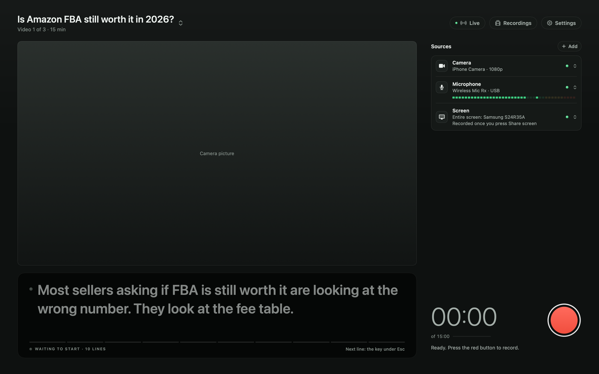

- **The title, top left.** The script you are filming and its target length. Click it for the day's list of scripts. With no script it says "No script".
- **Live**, **Recordings** and **Settings**, top right. **Live** only shows while live view is on. Each setting in Settings says in one sentence what it does.
- **The camera picture.** What the main camera sees.
- **Sources.** Everything that gets recorded, one row each, with a lamp: green is ready, amber needs a look, red cannot record. Click a row to change it. **+ Add** adds another camera, another microphone, or a phone.
- **The note under Sources.** When something needs fixing, one note says what, with the button that fixes it.
- **The prompter**, under the camera picture when the window is wide enough.
- **The timer and the red button.** The timer shows the time recorded against the script's target ("of 15:00"). The line under it says what to do next.

When Vidlark sits unused in the background for a while, the camera and mic rest to save power. Click the picture to wake them; it takes about a second.

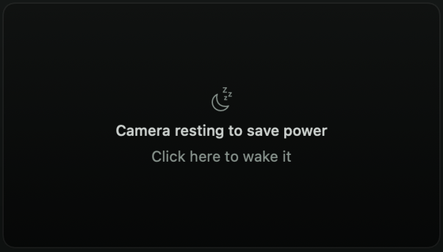

## Scripts and the prompter

A script is a plain `.md` or `.txt` file:

```
# How to fix a suppressed listing
Target: 15 min

## Hook
Written out word for word. It shows a short piece at a time.

## Section name
- One bullet per line
- You talk around each one
```

- The `#` line is the video's title. It names the take's folder. Without it, the file's name is used.
- `Target:` is the length you aim for. The timer and the prompter's time for each line use it.
- `##` starts a section. Sections and app switches become chapters.
- Plain paragraphs are read word for word. Bullets are talked around.

**Add scripts** by dragging the files onto the window, or click the title and pick **Add script file** or **Paste script**. Several scripts make a list for the day. After a take, **Next video** loads the next one that has not been filmed.

**The prompter** shows the script one line at a time:

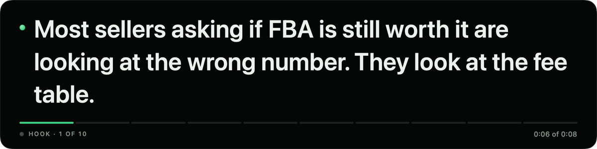

Open Settings, **Prompter and remote** to set it up:

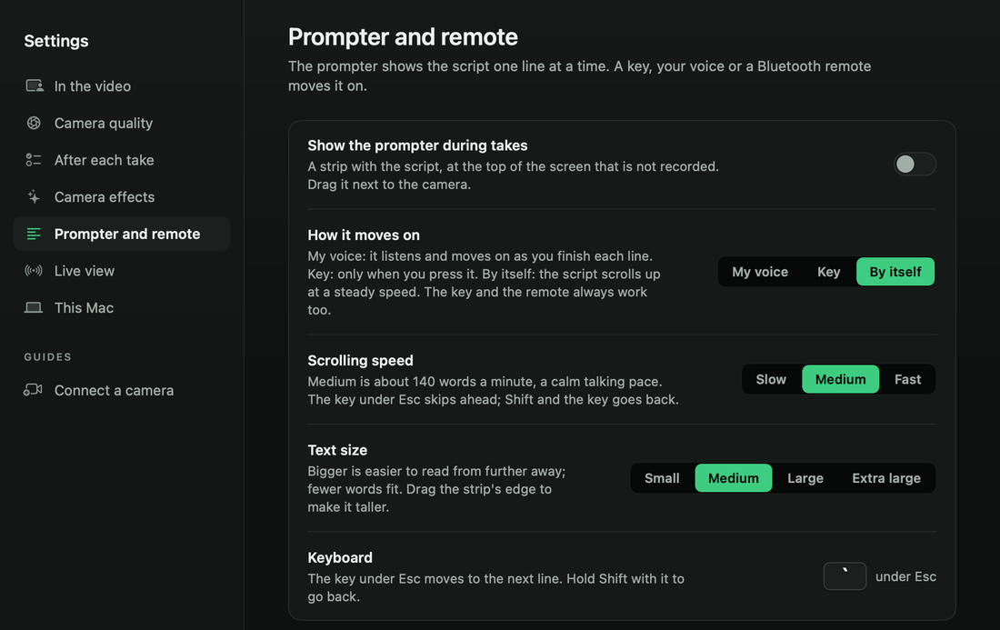

- **Show the prompter during takes** puts it in a strip at the top of the screen that is not recorded. Drag it next to the camera. It is off at first.
- **How it moves on:** **My voice** listens and moves on as you finish each line. **Key** moves only when you press it. **By itself** scrolls at a steady speed (Slow, Medium or Fast). The key and a remote always work too.
- **The key under Esc** (the backtick key, top left of the keyboard) moves to the next line, even while another app is in front. Hold Shift with it to go back.
- **Text size**, from Small to Extra large.
- **Remote buttons.** Pair a Bluetooth remote or presentation clicker in System Settings, Bluetooth, then press **Set** next to Next line, Previous line, Switch Me and Screen, or Start or stop recording, and press the remote's button.

## A take, start to finish

1. **Press the red button.** Three short beeps count down 3, 2, 1, and a higher beep means go. The count is not recorded. Press the button again during the count to call the take off.
2. **You are recording your camera.** Every take starts on your camera, in the Vidlark window. The timer starts at 00:00 on go.
3. **Press Share screen** when you want the screen in the video. **What to share** opens: pick **Entire screen** or **A window** from pictures, then **Share**. Windows on other desktops, like an app in full screen, are listed too. Your last pick comes up already picked. (Settings, In the video, **Ask what to share each time** turned off skips this and shares your last pick straight away.)
4. **The recording box.** The Vidlark window steps aside and a small box sits in the top corner. Your camera fills the screen for a moment, then the video changes to the screen.

| Showing the screen | Showing you (Me) | Your face in the video |
|:---:|:---:|:---:|
| 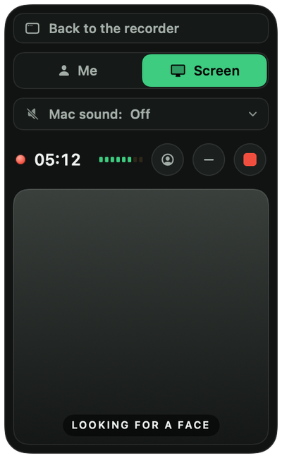 | 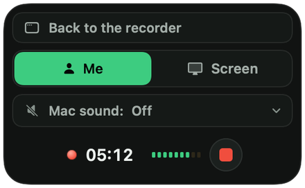 | 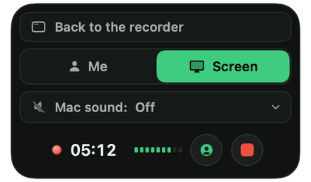 |

- **Me** grows your camera out of the corner to fill the screen. **Screen** shrinks it back. The screen recording captures that motion, so `video.mp4` needs no cutting.
- **Mac sound** chooses what the Mac plays into the video: **Off**, **Every app**, or **Only** one app (for example a video in Chrome, so notification sounds stay out). Change it at any moment.
- **The face button** puts your face in a corner of the video, in the shape picked in Settings, In the video. Drag it anywhere. While it is in the video, the box hides its own face picture, so only one face shows at a time.
- **The face picture** in the box shows your face, framed automatically: still while you talk, a smooth glide when you move. Click it to see the whole camera picture. The **minus** button hides it.
- **Back to the recorder** brings the Vidlark window up over everything, without leaving the shared window. **Hide the recorder** puts it away. The recording carries on.
- **The red square** stops the take.

Nothing in the box, and no Vidlark window, ever appears in the video. Sharing one window, only that window goes into the video, even if something covers it, and the recording follows it if you move it.

5. **Say "retake"** if you stumble, and say the line again. The take keeps going, and `retakes.json` lists every retake with its time.
6. **Press stop.** The Vidlark window comes back while it finishes the take: it lines up the files by sound, makes `video.mp4` and writes the transcript, chapters and retakes. A long take takes a minute or two.

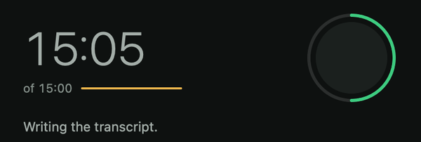

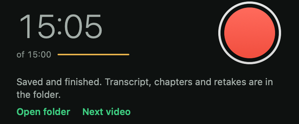

7. **Open folder** shows the take's folder. `video.mp4` is the one to upload; the camera and screen files stay for anyone who wants to edit.

If the camera stops sending pictures during a take, Vidlark stops the take within a few seconds and says so. Everything recorded until then is kept.

## Recordings

Click **Recordings** at the top right (or press Command-Shift-R) for every take, newest first, with a picture, its length and its size on disk.

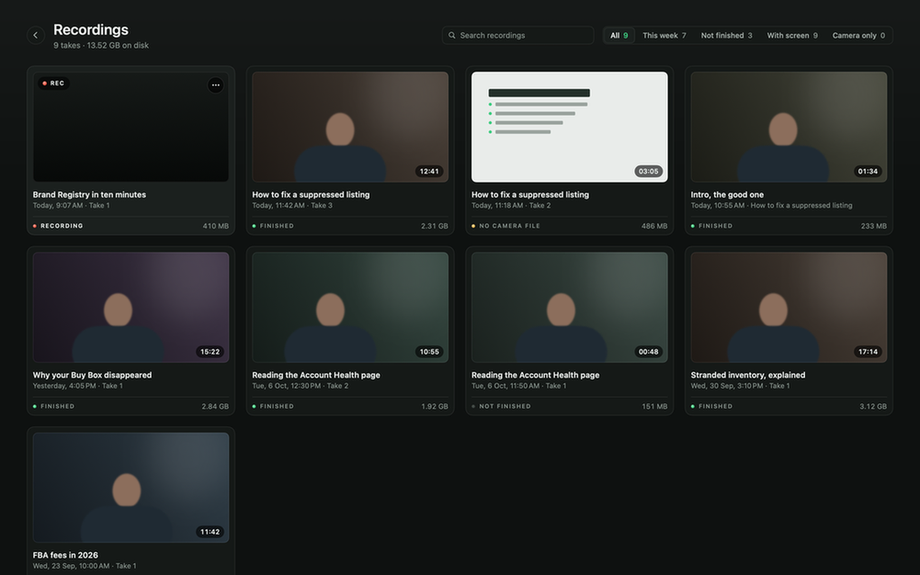

- **Search** by name, or filter by **All**, **This week**, **Not finished**, **With screen** or **Camera only**.
- **Each take's menu** (the **...** button): **Watch**, **Show in Finder**, **Rename** (the folder on disk gets the new name too), **Save a Copy**, and **Delete**, which moves the take and all its files to the Trash.
- **Status:** Finished, Not finished (the after-stop step did not run or did not complete), No camera file, or Recording.

Click a take to watch it in the app:

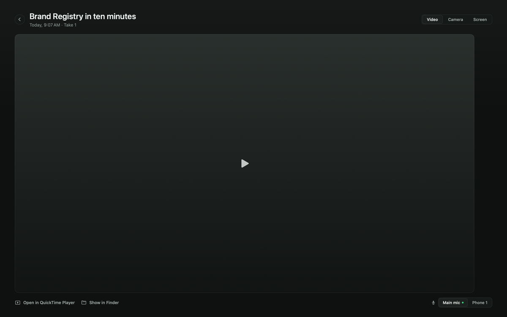

- **Video**, **Camera** and **Screen** (and any extra cameras) switch at the same moment of the take.
- **The mic switch** at the bottom right plays any mic under any picture, to hear which sounds best.
- **Open in QuickTime Player** and **Show in Finder** are at the bottom left.

## Cameras

Click the **Camera** row to pick the main camera. Settings, **Connect a camera** walks through each kind, and lists the cameras the Mac sees right now.

**A phone over Wi-Fi.** Any iPhone or Android phone, with any account, on the same Wi-Fi as the Mac. No app and no cable.

1. Click the Camera row and pick **Phone over Wi-Fi** to film with the phone, or press **+ Add**, **Add a phone with a QR code** to film another angle next to the main camera.
2. Point the phone's camera at the code and tap the link.
3. The first time, the phone warns that the connection is not private. The link is Vidlark's own, only on your Wi-Fi. On an iPhone, tap **Show Details**, then **visit this website**, then **Visit Website**. On Android, tap **Advanced**, then **Proceed**.
4. Pick **Wide 16:9** or **Tall 9:16**, tap **Start camera**, then **Allow**. The picture keeps that shape however the phone turns. Keep the page open.

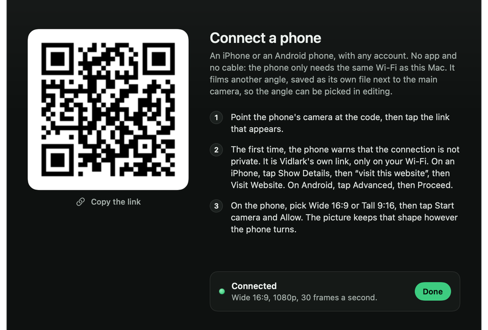

A phone records up to 1080p at 30 frames a second. Up to four phones can film at once (Phone 1 to Phone 4), each saved as its own file and lined up by sound, so the angle can be picked in editing. A phone filming another angle shows its picture on its own screen between takes, but sends nothing until a take starts (or the Mac shows its picture), which saves its battery. Keep it plugged in for a long take.

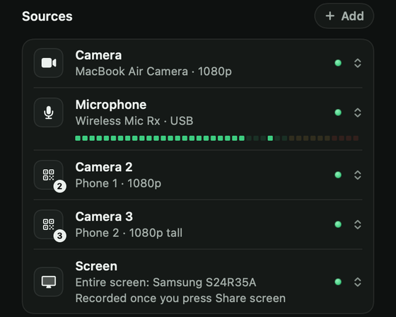

**An iPhone through Continuity Camera.** Apple's own link, with the sharpest picture. It needs an iPhone XR or newer with iOS 16 or later, signed in to the same Apple Account as the Mac, with Wi-Fi and Bluetooth on. On the iPhone, open Settings, General, AirPlay & Continuity, and switch on Continuity Camera. Put it in a stand, sideways, back cameras facing you, and lock it. It shows up as a camera in a few seconds.

**A USB webcam.** Plug it in. Most need no software.

**A real camera.** Try a USB cable with the maker's free webcam app first. Otherwise use an HDMI to USB capture card, and turn off the information on the camera's screen.

**Another camera at the same time.** Press **+ Add** and pick it under **Another camera**. It records its own file (`camera-2.mov` and on), lined up by sound. The main camera stays in `camera.mov`.

**Quality and effects.** Settings, **Camera quality** picks the sharpness and **Smooth motion** (60 frames a second, files about twice as big). Settings, **Camera effects** shows macOS's Studio Light, Portrait and Center Stage, and opens the panel that switches them. Center Stage can drift while you talk with your hands, so it is usually best off.

## Microphones

The **Microphone** row is the main mic. Its sound goes into `camera.mov` and `screen.mov`, and lines the files up.

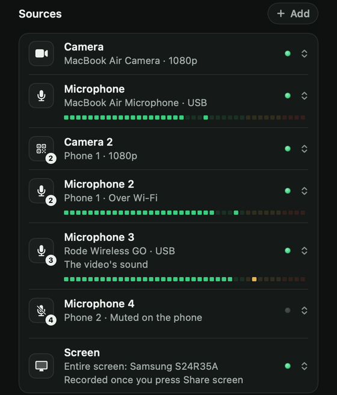

- **Another mic.** Press **+ Add** and pick it under **Another microphone**: a USB mic, a wireless kit's receiver, or AirPods (they record at phone call quality, so a USB mic or a wireless kit sounds better).
- **A phone filming an angle** can record its own sound too: pick its mic under Another microphone.
- **A phone as a wireless mic only.** Pick **A phone as a microphone, with a QR code**, scan it, tap **Start microphone**, then **Allow**, and keep it about a hand's width from the mouth of the person talking.

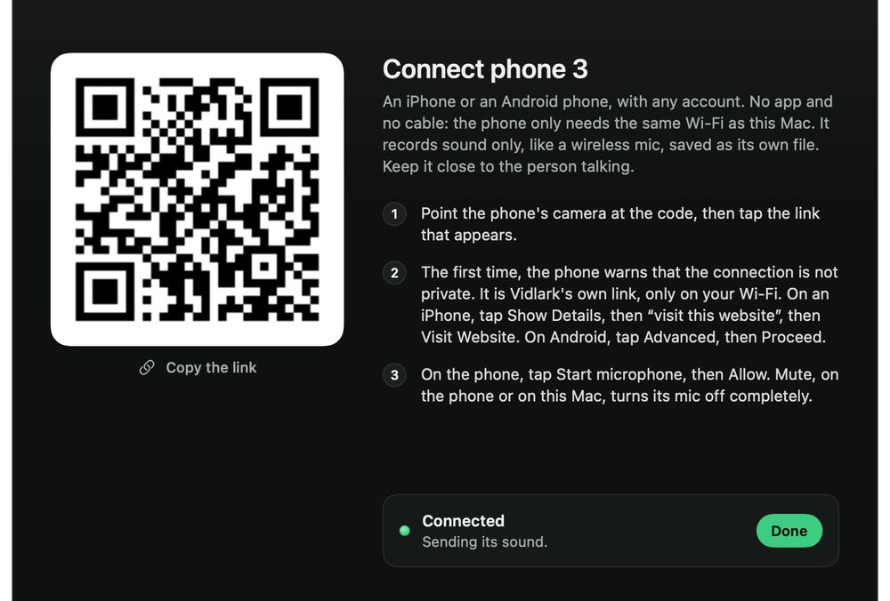

Every mic records its own file (`mic-2.m4a` and on). The video uses the main mic unless another row's menu says **Use for the video's sound**; that row then reads "The video's sound".

A phone's **Mute** is one switch shared by the phone and the Mac. Tap Mute on the phone, or pick it in the phone's row on the Mac. Either side can unmute. While muted, the phone's mic is fully off, and its file stays silent for that stretch so it still lines up.

## Live view

Watch the shoot from another laptop or a phone, in a web browser, with no login. Open Settings, **Live view** and pick:

- **Home Wi-Fi:** works on the same Wi-Fi. The link stays the same, so bookmark it once.
- **Anywhere:** works from any internet connection, through a free Cloudflare tunnel. The link changes each time it starts. It needs one more free tool: `brew install cloudflared`.

**Copy link** puts the link on the clipboard. The page shows every camera, the screen while recording, the mic level and the checks. **Listen** plays the mic as it is recorded, to catch echo or hum (use headphones). Pin any picture to make it big, or go full screen. The picture the finished video is showing says **In the video**, and during a take the page shows the prompter line being read.

The secret in the link is the only key. Anyone with it sees your screen, including anything private on it, so never post it. **New link** stops every old link working.

## Settings, page by page

Open Settings with the gear button or Command-Comma.

**In the video**

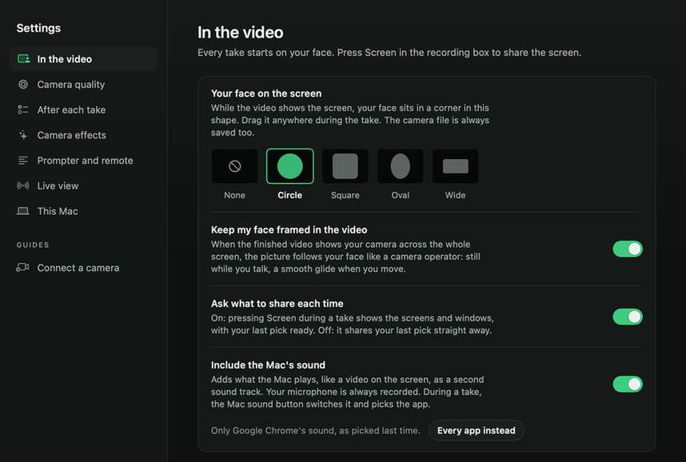

- **Your face on the screen:** None, Circle, Square, Oval or Wide. While the video shows the screen, your face sits in a corner in this shape.
- **Keep my face framed in the video:** where the finished video shows your camera across the whole screen, the picture follows your face. On at first.
- **Ask what to share each time:** shows the What to share window, or shares your last pick straight away.
- **Include the Mac's sound:** adds what the Mac plays as a second sound track. Your mic is always recorded.

**Camera quality:** Sharpness and Smooth motion, with how much space 15 minutes takes.

**After each take**

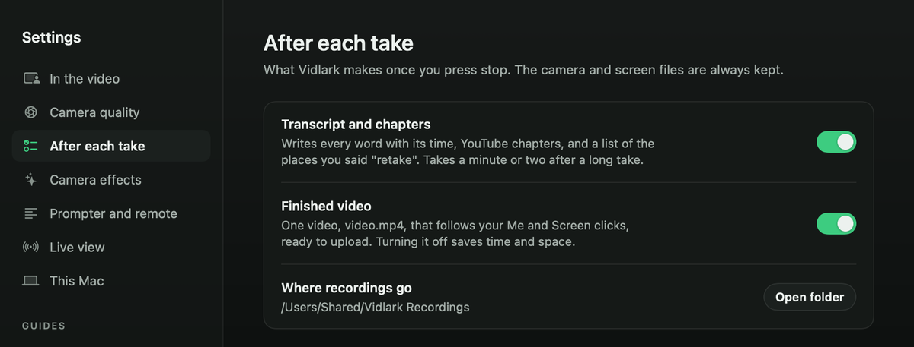

- **Transcript and chapters:** off for a quick video that does not need them. The files are still lined up and the report is still written.
- **Finished video:** turn it off to skip `video.mp4` and save time and space.
- **Where recordings go**, with **Open folder**.

**Camera effects:** Studio Light, Portrait and Center Stage, and **Open Video Effects**.

**Prompter and remote:** see [Scripts and the prompter](#scripts-and-the-prompter).

**Live view:** see [Live view](#live-view).

**This Mac:** free space (a 15 minute take needs about 3 GB, plus about 0.5 GB for the finished video), power, Low Power Mode (keep it off while filming: the camera freezes once the screen is shared), and **Light mode**, which records at 1080p and 30 frames a second so a slower Mac keeps up.

**Connect a camera:** the guide in [Cameras](#cameras), with the cameras the Mac sees right now.

## The files in a take

The [README's table](../README.md#where-your-recordings-go) lists the files you will use. [PLAN.md](../PLAN.md) describes every file and what is inside it, for editing tools and for anyone changing the code.

The after-stop step is a separate tool, `vidlark-finish`, inside the app. You can run it by hand on any take's folder, for example to finish a take marked Not finished:

```bash
~/vidlark/dist/Vidlark.app/Contents/MacOS/vidlark-finish "/Users/Shared/Vidlark Recordings/<date> <title>/recording-1"
```

Add `--no-transcribe`, `--no-chapters`, `--no-video` or `--no-framing` to skip a step.

## Vidlark for Windows (beta)

The Windows app writes the same take folder with the same files, so a take looks the same whichever computer recorded it. The [README](../README.md#install-on-windows-beta) has the download steps.

What is different in the beta:

- There is a title box at the top instead of scripts.
- The recording box has **Me**, **Screen**, **Face** (your face in the corner, a circle, or not), **Sound** (the computer's sound on or off), **Vidlark** (the window back) and Stop.
- Sound comes from every app or none, not from one app.
- A shared window is cut out of its screen, so a window dragged over it shows too.
- Not yet: the transcript, phones, live view, the prompter, face framing, and the Recordings and Settings pages.
- Windows 11 may draw a thin yellow frame round the screen while it is recorded. That frame is not in the video.

Testing the beta on a real laptop? [windows/TESTING.md](../windows/TESTING.md) has the checklist.

## Keyboard shortcuts

| Keys | What they do |
|---|---|
| Command-Comma | Open Settings |
| Command-Shift-R | Open Recordings |
| Command-[ | Back from Recordings to the recorder |
| ` (the key under Esc) | Prompter: next line, even while another app is in front |
| Shift-` | Prompter: previous line |
